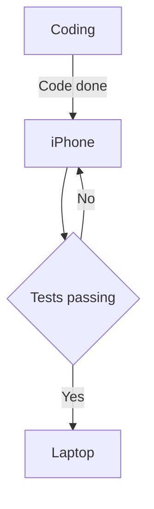
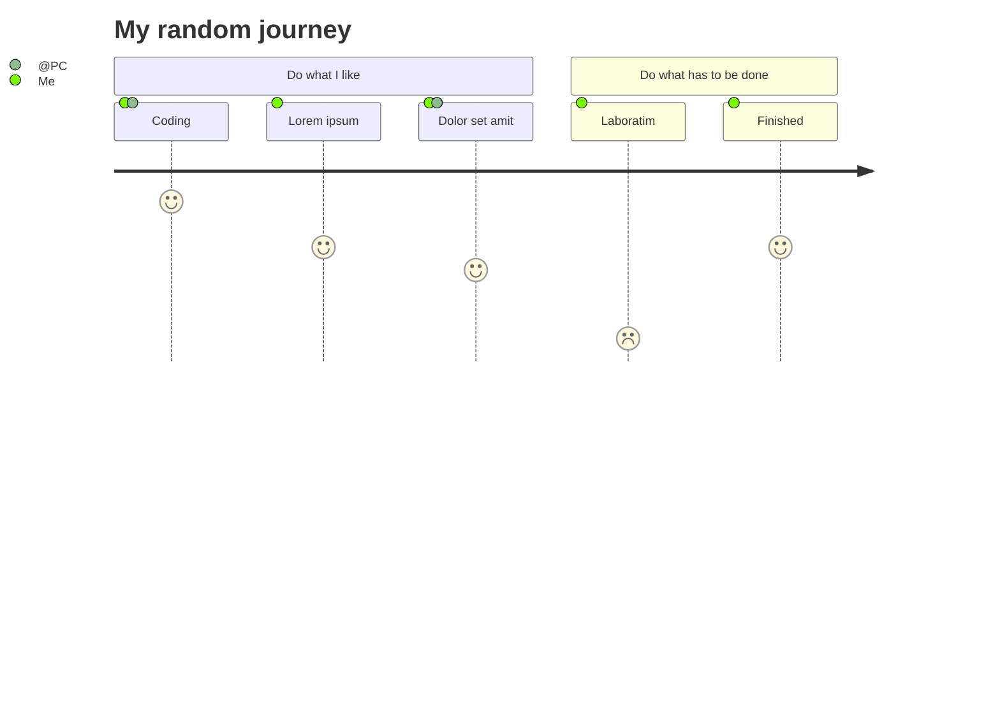

# Hello MermaidJS


## Integrations
Use markdown language to create different kind of charts in
- README.mds (by default: GitHub, GitLab)
  - IDE: VsCode via plugin: 
- ReactJS via npm package (react-mermaid)
- HTML-files (using Javascript)


## Supported chart-types
- Flowchart
- Sequence diagram
- Gantt diagram
- Class diagram
- Git Graph
- ER diagram (experimental)
- User Journey
- Pie Charts
- Requirement diagram
- Context diagram

## Personal opinion
Advantage instead of create diagrams with e.g. draw.io
- Diagrams as markdown text in repo
- Embed diagrams directly instead of images of the diagram itself
- Creates vector graphics for best scalablity (export as PNG available too)
-



```mermaid
gantt
    title Onboarding
    dateFormat  DD.MM.YYYY
    section Ablauf
    Welcome                  :a1, 30min
    Get familiar with MacOS  :after a1, 1h
    section Installing programs
    communication software     :after a1, 30min
    Dev Tools (GIT)       : 30min
    VSCode + Plugins      : 30min
    another task      : 30min
    another task      : 30min
```


      


# References:
[GitHub - Mermaid-js](https://mermaid-js.github.io/mermaid/#/)
[NPM react-mermaid](https://www.npmjs.com/package/react-mermaid)